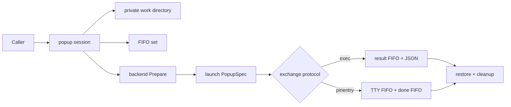
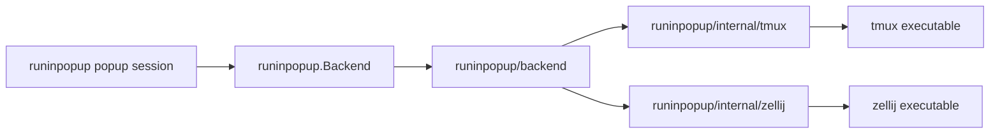

# PLAN — refactor batch 1

Execute the twelve refactor items recorded in [`../refacotr.md`](../refacotr.md)
as eight ordered slices, preserving all user-observable behavior except the
explicitly decided pre-1.0 API breaks.

Source document: `doc/plan/refacotr.md` (found in the `main` worktree on
2026-08-17, same commit this branch sits on). It stays in place as the
evidence record; this plan cites its sections rather than restating them.
Decisions D1–D7 in [DECISION.md](./DECISION.md) quote its "Agreed direction".

## Goal / success criteria

- All twelve decisions (D1–D12) are implemented, each operative clause owned
  by a step below (see **Decision → step traceability**).
- `go test ./...` and `go vet ./...` pass after every slice, and `go test
  ./...` is hermetic on a machine where tmux is installed but unusable
  (live tmux tests run only behind an explicit integration mechanism).
- CLI commands/flags, JSON result bytes, config file schema, and
  `PINENTRY_USER_DATA` handling are unchanged.
- The only public API changes are the ones enumerated in **Public surface
  delta** below.

## Scope

The P0–P3 items of `../refacotr.md`:

| Item | Slice (step) |
| --- | --- |
| P0 characterize pinentry lifecycle, isolate live tests | 1 |
| P1 move backend vocabulary into `runinpopup/backend` | 2 |
| P1 internal multiplexer clients, remove `PopupCommand`/`Environ` | 2 |
| P1 extract CLI runtime/backend resolution | 3 |
| P1 common popup-session lifecycle | 4 |
| P1 launcher vs payload completion explicit | 4 |
| P1 split TTY acquisition / Assuan rewriting / pinentry execution | 5 |
| P1 adopt `go-common/iopipe` | 5 |
| P3 retire or centralize compatibility shims | 6 |
| P3 runworkspace cleanup tightening | 6 |
| P2 split exec by responsibility | 7 |
| P2 one configuration schema source; scaffold residue | 8 |

## Non-goals

Explicitly not recommended by the source document ("Ideas deliberately not
recommended now"):

- a generic FIFO package;
- a dynamic backend registry;
- breaking up `callPinentry` merely for length (its FIFO order is a protocol
  invariant);
- replacing typed config with maps/reflection.

Also out of scope: any behavior change to the exec/pinentry FIFO protocols,
and any new feature work.

## Context

- Go 1.26 module; primary Cobra CLI `cmd/run-in-popup`, deprecated binaries
  `cmd/tmux-popup-pinentry-curses` and `cmd/zellij-popup-pinentry-curses`;
  importable `runinpopup` package; backends in `runinpopup/backend`
  (`tmux_popup.go`, `tmux_floating_pane.go`, `zellij.go`).
- `runinpopup/pinentry.go:114` (`callPinentry`) owns FIFO creation, popup
  launch, TTY discovery, Assuan rewriting, pinentry execution, cancellation,
  and cleanup in one flow, with no end-to-end test.
- `runinpopup/backend/tmux_live_test.go:89,141` start real tmux servers in the
  default test suite.
- `runExec` (`cmd/run-in-popup/commands/exec.go:75`) and `runPinentry`
  (`cmd/run-in-popup/commands/pinentry.go:84`) duplicate config/user-data/
  backend resolution; workspace creation is duplicated again in both
  compatibility shims via `internal/runworkspace`.
- Timing-sensitive FIFO flows are heavily documented; refactors must preserve
  their ordering and lifecycle invariants explicitly.

### Target shape

Popup-session lifecycle (D1) — the session supplies concrete resources to an
exchange implementation; the two protocols share lifecycle, not semantics:



Package ownership after D4/D6/D7 — public backends keep mechanism policy,
internal clients speak to the executables:



## Public surface delta

Everything user-visible that changes is in this block; anything not listed is
out of scope by definition.

```go
// ---- launch layer: Backend contract break + entry point (D7, D13) ----

// Removed from runinpopup.Backend:
//     PopupCommand(spec PopupSpec) (path string, args []string)
//     Environ() []string

// Split specs (D15, corrected by user 2026-08-18): PopupSpec is the
// launcher-level *persistent template* — reusable across launches, so it
// carries no streams. LaunchSpec is the mechanism-level spec built fresh
// for exactly one launch, so the per-launch streams fold into it, and its
// command line already includes the payload FIFO wiring. Backends do no
// piping.
type PopupSpec struct {
    // ...existing payload fields (command line, title, ...) — no streams.
}

type LaunchSpec struct {
    // ...one-shot command line with the payload FIFO wiring folded in...

    // The per-launch payload stdio endpoints, folded in from the
    // PopupStreams passed to Exec (LaunchSpec is built for exactly one
    // launch). Backends still do no piping — PopupLauncher owns it; the
    // launcher process's own output goes to internal diagnostics/logging.
    Stdin  io.ReadCloser
    Stdout io.WriteCloser
    Stderr io.WriteCloser
}

// PopupStreams is the *payload's* stdio endpoint set — a separate struct
// passed per Exec call, never part of the PopupSpec template. The rule is
// uniform across all three streams, stdin included: nil = no allocation,
// that stdio stays on the popup TTY; non-nil = a FIFO is allocated for it
// and connected to the given endpoint.
type PopupStreams struct {
    Stdin  io.ReadCloser
    Stdout io.WriteCloser
    Stderr io.WriteCloser

    // StdoutPipe/StderrPipe request a piped reader for that stream,
    // exposed by PopupCommand.StdoutPipe/StderrPipe — os/exec style. A
    // non-nil Stdout/Stderr endpoint above has higher priority than the
    // corresponding bool.
    StdoutPipe bool
    StderrPipe bool
}

// PopupHandle is deliberately wait-only: stream piping is backend-agnostic
// and lives in the wrapper (D13).
type PopupHandle interface {
    Wait() error
}

// Final Backend surface — Launch's former separate streams parameter is
// folded into the one-shot LaunchSpec:
type Backend interface {
    Name() string
    Launch(ctx context.Context, spec LaunchSpec) (PopupHandle, error)
    Prepare(ctx context.Context) (restore func(context.Context) error, err error)
}

// Added — the single wrapping entry point for launching popups (D13/D15):
// owns the work directory (workspace), allocation of FIFO files backing the
// *payload's* stdin/stdout/stderr, spec completion wiring those FIFOs,
// Prepare/best-effort restore, Backend.Launch, and stream piping. The
// exchange launchers below sit one wrapper layer above it.
type PopupLauncher struct {
    Backend Backend
    Logger  *slog.Logger // nil discards
    // Workspace and StartupTimeout are session infrastructure, owned here
    // rather than per exchange launcher (D15).
    Workspace      WorkspaceOptions // D12
    StartupTimeout time.Duration    // rendezvous bound; zero means 30s
}

// Exec launches the template's popup — launch-level "execute", not the
// exec exchange: it allocates a workspace FIFO for each non-nil stream in
// streams (nil = no allocation, that stdio stays on the popup TTY), builds
// the one-shot LaunchSpec from the template with that wiring in the
// command line, launches through the backend, and pipes each allocated
// FIFO to/from its endpoint.
func (l *PopupLauncher) Exec(
    ctx context.Context,
    spec PopupSpec,
    streams PopupStreams,
) (*PopupCommand, error)

// PopupCommand is the wrapper-owned handle of a launched popup.
type PopupCommand struct{ /* unexported */ }

func (c *PopupCommand) Wait() error

// StdoutPipe/StderrPipe return the reader allocated when the matching
// PopupStreams.StdoutPipe/StderrPipe bool was set. The bool result is
// false when piping was not requested (flag unset, or overridden by a
// non-nil endpoint).
//
// Backing is an implementation detail below this contract, settled as:
// io.Pipe (or iopipe's derived endpoint, D3) fed by a pump goroutine off
// the FIFO — not os.Pipe and not the raw FIFO fd. The pump normalizes
// FIFO open/EOF quirks (a FIFO read side can see EOF before the payload
// opens its write side) into plain pipe semantics, and CloseWithError
// carries the real terminal cause (FIFO error, cancellation, launcher
// failure) into a blocked Read per D3's error-priority rules. Buffering
// comes from the FIFO's own 64KiB kernel pipe buffer (F_SETPIPE_SZ if a
// real workload ever needs more); a stalled consumer backpressures the
// popup command exactly as os/exec.StdoutPipe would.
func (c *PopupCommand) StdoutPipe() (io.ReadCloser, bool)
func (c *PopupCommand) StderrPipe() (io.ReadCloser, bool)

// ---- backend vocabulary moves (D4; clean break per D10) ----

// Removed from package runinpopup:
//     BackendTmuxPopup, BackendTmuxFloatingPane, BackendZellij
//     func BackendNames() []string
//     func DetectBackendName(...) (string, error)

// Owned by package runinpopup/backend:
const (
    NameTmuxPopup        = "tmux-popup"
    NameTmuxFloatingPane = "tmux-floating-pane"
    NameZellij           = "zellij"
)

func Names() []string
func DetectName(userDataKind, tmuxEnv, zellijEnv string) (string, error)
func New(name string, opts Options) (runinpopup.Backend, error)

// ---- runinpopup.Run removed (D9, replacement superseded by D13) ----

// Removed from package runinpopup:
//     type RunOptions struct { Logger *slog.Logger; Spec PopupSpec; Stdout, Stderr io.Writer }
//     func Run(ctx context.Context, backend Backend, opts RunOptions) error
// D9's original "no exported replacement" clause is superseded by D13:
// PopupLauncher.Exec + PopupCommand.Wait are the accurately named launch
// API. Run's wait behavior is still not silently changed — Run is gone.

// ---- exchange layer: PinentryLauncher, JsonIpcLauncher (D13, D14, D15) ----

// One-shot exchange launchers (exec.Cmd-style: configure fields, call once),
// one wrapper layer above PopupLauncher. Session infrastructure (workspace,
// rendezvous bound) comes from the Popup field (D15).
type PinentryLauncher struct {
    Popup        *PopupLauncher
    PinentryPath string         // empty means DefaultConfig().PinentryPath
    PinentryArgs []string
    Timeouts     TimeoutsConfig // zero fields fall back to DefaultConfig()
}

func (l *PinentryLauncher) Call(ctx context.Context) error

// Bidirectional JSON IPC with the popup payload (D15). Input reaches the
// payload one of two ways: (1) streamed — In values JSON-encoded onto the
// payload's stdin FIFO via the conn's Send; (2) launch-time — an In value
// marshaled into the popup command's arguments by AddPayload, the
// caller-configured spec constructor (chosen over insertion-index schemes).
// Output is the payload's stdout: one or more JSON Out values, surfaced as
// a stream.
type JsonIpcLauncher[In, Out any] struct {
    Popup *PopupLauncher
    // PartialSpec is the popup spec before payload wiring; AddPayload
    // completes it, inserting the marshaled launch-time input where the
    // caller decides. nil AddPayload means stdin-only input.
    PartialSpec PopupSpec
    AddPayload  func(v In, spec PopupSpec) PopupSpec
}

// Exec is the single entry method for both input modes (a separate Start
// was rejected: AddPayload itself decides to add or ignore v). It hands v
// to AddPayload (nil AddPayload ignores it), wires its pipes into the
// PopupStreams it passes to the launch layer, launches, and returns the
// stream controller.
func (l *JsonIpcLauncher[In, Out]) Exec(ctx context.Context, v In) (*JsonIpcConn[In, Out], error)

// JsonIpcConn is the stream controller (type name is a planner call).
type JsonIpcConn[In, Out any] struct{ /* unexported */ }

// Send JSON-encodes v onto the payload's stdin.
func (c *JsonIpcConn[In, Out]) Send(ctx context.Context, v In) error
// Results streams decoded Out values from the payload's stdout; closed when
// the exchange ends.
func (c *JsonIpcConn[In, Out]) Results() <-chan Out
// Wait blocks until the exchange completes and returns its terminal error.
func (c *JsonIpcConn[In, Out]) Wait() error

// The exec exchange becomes a JsonIpcLauncher with Out = ExecResult, the
// inner command as its launch-time input, and nothing streamed; exec's
// result JSON bytes are unchanged, now carried on the payload-stdout FIFO.

// ---- exec payload contract (D15 fallout; shape is a planner call) ----

// ExecPayload keeps its exported name, but its argv convention changes:
// the result-FIFO path argument disappears — the payload writes the result
// JSON to its own stdout, which the launch layer has wired to a FIFO:
//     <PayloadPath> exec-payload [rendezvous-timeout] -- <Command...>
// The rendezvous timeout still travels in the payload argv so both halves
// give up together; since AddPayload builds the argv, callers thread
// PopupLauncher.StartupTimeout into their AddPayload/PartialSpec themselves
// (the JsonIpc layer does not inject it). The payload hands the popup TTY
// to the inner command in place of its own captured stdio.

// ---- CallExec / CallPinentry dissolved (D14) ----

// Removed from package runinpopup — the launcher structs above are the only
// exchange API; the CLI constructs them directly:
//     type ExecOptions struct{ Logger; TempDir; Command; Title; PayloadPath; StartupTimeout }
//     type PinentryOptions struct{ Logger; TempDir; PinentryPath; PinentryArgs; Timeouts }
//     func CallExec(ctx context.Context, backend Backend, opts ExecOptions) (ExecResult, error)
//     func CallPinentry(ctx context.Context, backend Backend, opts PinentryOptions) error

type WorkspaceOptions struct {
    // Dir, when non-empty, is the work directory holding the exchange's
    // FIFOs; the caller owns its lifetime and the session never removes it.
    // Empty means the session creates a mode-0700 directory under
    // os.TempDir() and removes it on completion.
    Dir string
    // NamePrefix prefixes the name of a session-created directory.
    // Empty means "run-in-popup-". Ignored when Dir is set.
    NamePrefix string
    // Retain keeps a session-created directory after completion, for
    // debugging. The retained path is reported through Logger. Ignored when
    // Dir is set.
    Retain bool
}

// ExecResult and its JSON encoding are unchanged: the retained path is
// reported only through the structured log, in both CallExec and
// CallPinentry.

// ---- deprecated binaries retained (D11) ----
// cmd/tmux-popup-pinentry-curses, cmd/zellij-popup-pinentry-curses:
// kept for multiple releases, backed by internal/legacyshim; no removal
// release scheduled in this batch; their CLI surface is unchanged.

// ---- explicitly unchanged ----
// run-in-popup CLI commands and flags; exec JSON result bytes; config file
// schema and keys; PINENTRY_USER_DATA format and precedence.
```

## Implementation steps

Ordering follows the source document's "Suggested execution slices". After
every step: `go test ./...` and `go vet ./...`; the tagged tmux integration
suite runs separately on a host that permits private tmux sockets.

### Step 1 — Hermetic test split + pinentry characterization (P0)

- Add a fake handshaking backend and injectable process/stdio seams in
  `runinpopup` sufficient to characterize `callPinentry`: TTY replacement,
  unchanged non-TTY Assuan lines, popup dismissal, pinentry start failure,
  cancellation, FIFO timeout.
- Move `runinpopup/backend/tmux_live_test.go` behind `//go:build integration`
  (or equivalent explicit mechanism) and document the enabling command; keep
  version-parsing and argv tests in the default suite.
- Add table tests for `cli.RenderConfig` and `cli.RenderExecResult`
  (`runinpopup/cli/config.go`, `runinpopup/cli/exec.go`).

Done when: default `go test ./...` never touches a real multiplexer; an Assuan
transcript test proves the exact bytes forwarded to pinentry; cancellation
tests prove every owned process and pipe is released.

### Step 2 — Internal clients + backend vocabulary + contract break (D4, D6, D7)

- Create `runinpopup/internal/tmux` and `runinpopup/internal/zellij` clients
  per D6 (typed requests, own argv/env/`exec.CommandContext`/SIGINT/stderr
  decoration/raw-output parsing, including `tmux -V` and zoom-state parsing
  now in `runinpopup/backend/tmux_floating_pane.go:177`).
- Move shell-line rendering alongside; share only POSIX word quoting through
  `runinpopup/internal/shellargv` if both executables need it.
- Move backend name constants, `Names`, `DetectName` implementations, and
  their tests into `runinpopup/backend/backend.go` (D4); delete the parent
  package's `BackendTmuxPopup`/`BackendTmuxFloatingPane`/`BackendZellij`,
  `BackendNames`, and `DetectBackendName` outright (D10 clean break) and note
  the break for release notes.
- Replace `PopupCommand`/`Environ` with `Launch` + the wait-only
  `PopupHandle` (D7) across the contract and all three backends.
- Build the exported launch layer (D13/D15): `PopupLauncher` struct with
  `Exec(ctx, spec, streams) (*PopupCommand, error)` owning prepare/restore,
  FIFO allocation per non-nil endpoint (nil = no allocation), launch, and
  the pipe goroutines; `PopupCommand` with `Wait` and the
  `StdoutPipe`/`StderrPipe` `(io.ReadCloser, bool)` methods. Pipe-request
  readers are backed by io.Pipe/iopipe pumps off the FIFOs — never the raw
  FIFO fd, so FIFO open/EOF quirks and cancellation stay normalized inside
  the launch layer (see the delta comment). It replaces
  `runinpopup/startPopup` and `withPopupPrepared`; `callPinentry` and
  `callExec` drive it until their own migration in steps 4–5.
- Delete `Run` and `RunOptions` (`runinpopup/run.go:16,37`) (D9 — no callers
  outside tests); its coverage in `runinpopup/run_test.go:47-101` moves onto
  `PopupLauncher.Exec` tests.
- Split the specs (D15): `PopupSpec` (launcher-level persistent template,
  no streams) vs the one-shot `LaunchSpec` (mechanism-level; payload FIFO
  wiring in the command line, per-launch payload endpoints folded in —
  `Backend.Launch` loses its separate streams parameter, launcher-process
  output becomes internal logging). Payload endpoints travel in the
  separate `PopupStreams` struct passed per `PopupLauncher.Exec`, uniform
  rule stdin included: nil = no allocation.
- Move exact-argv/environment/executable-error tests into the internal client
  packages; keep backend tests on `LaunchSpec` translation, capability
  selection, targeting, and prepare/restore policy.

Done when: `runinpopup/run.go` has no multiplexer `exec.CommandContext` or
environment manipulation; no `PopupCommand`/`Environ` anywhere; backend name
literals are declared once; each executable has one invocation path.

### Step 3 — CLI runtime/backend resolver (D5)

- Add `cmd/run-in-popup/commands/runtime.go` with `runtimeInputs`,
  `commandRuntime`, and `resolveRuntime(inputs, environ)` as sketched in the
  source doc; `runExec` and `runPinentry` call it against the step-2 backend
  factory.
- Cobra flag inspection stays in each command; workspace naming and
  debug-retention policy stay command-specific and are passed into the popup
  session (from step 4 on) rather than the command creating the IPC directory.

Done when: backend precedence and `backend.Options` construction exist in one
place; pure table tests cover flag/config/user-data/tmux/zellij precedence;
CLI behavior unchanged.

### Step 4 — Popup session + explicit launcher handle; migrate exec (D1)

- Add unexported `popupSession`/`withPopupSession` owning, in order: mode-0700
  work directory + retention policy; mode-0600 FIFO set; `Backend.Prepare` +
  best-effort restore; popup launch + launcher diagnostics; exchange
  execution; cleanup on every exit. Varying parts (FIFO endpoints, `PopupSpec`
  construction, completion event) go through narrow callbacks or an internal
  exchange interface; ordering stays in the session.
- The session launches through `PopupLauncher`/`PopupCommand` (step 2); no
  caller treats `PopupCommand.Wait` (launcher exit) as payload completion —
  launcher failure may shorten a rendezvous wait but must not race an
  already-starting payload.
- Build `JsonIpcLauncher[In, Out]` + `JsonIpcConn` (D13/D15) on the session
  and migrate the exec exchange onto it first, with `Out = ExecResult` and
  the inner command as launch-time input — the result-FIFO transport tests
  carry over to the payload-stdout FIFO; `ExecOptions`/`CallExec` dissolve
  here (D14), and the `Workspace`/`StartupTimeout` config is consumed from
  `PopupLauncher` (D12/D15). The exec exchange allocates payload stdout
  only (stdin/stderr nil — the inner command keeps the popup TTY on them);
  the exec payload must hand the popup TTY to its inner command's stdout
  too, since its own stdout is now the result channel, and its argv drops
  the result-FIFO path; the CLI threads `StartupTimeout` into its
  `AddPayload` closure so both halves still give up together.

Done when: `CallExec` contains exchange-specific work only; directory, FIFO,
prepare, launch, and cleanup have one owner; cleanup preserves the primary
error; tests cover failure at each lifecycle boundary, early successful
launcher exit, and late launcher failure.

### Step 5 — TTY rendezvous + Assuan transformer + iopipe; migrate pinentry (D2, D3)

- Rename/generalize `PinentryHandshaker`/`PinentryHandshake` to
  `TTYHandshaker`/`TTYHandshake` (construction + validation of the TTY/done
  exchange only).
- Extract `rewriteAssuanTTY(io.Reader, io.Writer, tty string) error` with
  transcript tests: replacement, pass-through, malformed/long input, EOF,
  read/write failures.
- Introduce `iopipe` controllers at the OS-stdio boundary per D3's error-
  priority rules; the pinentry coordinator takes interfaces, only the
  outermost adapter names `os.Stdin`/`os.Stdout`/`os.Stderr`.
- Build `PinentryLauncher` (D13) on the popup session and migrate the
  pinentry exchange onto it; `PinentryOptions`/`CallPinentry` dissolve here
  (D14). The pinentry exchange passes all-nil `PopupStreams` — no payload
  stdio allocation — so the handshake payload keeps the popup TTY untouched
  and no extra FIFO enters the rendezvous path.

Done when: backends name no pinentry-specific capability; no fire-and-forget
stdio goroutine; no library code closes process-global stdio; cancellation
deterministically ends controllers, pipes, transformer, and child; tests
assert byte delivery and `CloseError` handling; the coordinator is testable
with a fake handshake and fake process.

### Step 6 — Compatibility shims + workspace ownership (D11)

- Extract `internal/legacyshim`: one runner parameterized by backend kind,
  validation text, workspace prefix, and debug compatibility (D11);
  `cmd/tmux-popup-pinentry-curses/main.go` and
  `cmd/zellij-popup-pinentry-curses/main.go` become tiny adapters, with the
  runner's behavior covered by tests in the new package. Preserve the
  intentionally odd compatibility behaviors their comments document.
- Shims stop creating their own run directories (the popup
  session owns IPC directories); `internal/runworkspace` shrinks to debug-log
  policy or is removed. Fix its two defects during migration: roll back the
  created directory when opening the debug log fails
  (`internal/runworkspace/runworkspace.go:45,57`), and stop discarding all
  `Close` errors (`:71-77`).

Done when: no compatibility shim creates its own run directory; workspace
cleanup errors are reportable without replacing the primary error.

### Step 7 — Mechanical exec split (P2)

- Move code from `runinpopup/exec.go` (505 lines) without changing symbols or
  ordering into `exec_types.go`, `exec_caller.go`, `exec_payload.go`,
  `exec_status.go`; keep caller-side and payload-side FIFO helpers separate.
- Package comment points caller half to payload half and states the
  rendezvous invariant once.

Done when: exported API and JSON byte-for-byte unchanged; existing exec tests
move beside their responsibility and pass.

### Step 8 — Config schema source + residue cleanup (P2, P3)

- Add one authoritative schema-description function (or generated artifact)
  used by command help; reflection-based tests assert `Config` and
  `PartialConfig` (`runinpopup/config.go:44,104`) have matching JSON field
  trees; no reflection in the runtime merge path. If `Apply` (`:122`) grows
  repetitive, generate the sparse structs via `go generate`.
- Generate the backend list in `configLongFmt`
  (`cmd/run-in-popup/commands/config.go:13`) and other Cobra help from
  `backend.Names()` (it currently omits `tmux-floating-pane`).
- Remove obsolete scaffold TODOs in
  `cmd/run-in-popup/commands/root.go:60-69`.

Done when: adding a config field causes one clear test/generation failure at
every contract needing update; help vocabulary has one source; JSON/config
surfaces unchanged.

## Testing and verification

- `go test ./...` + `go vet ./...` after every step; suite must stay hermetic
  from step 1 on.
- Tagged tmux/zellij integration tests run separately against private
  instances; internal clients get a controllable command/process seam or
  helper-process tests for deterministic error/cancellation paths.
- Byte-level checks where the contract demands it: Assuan transcript bytes
  (step 1/5), exec JSON result bytes (step 7), config JSON field trees
  (step 8).

## Risks

- The FIFO flows are timing-sensitive protocol code; steps 4–5 must preserve
  the documented ordering invariants, which is why step 1's characterization
  tests come first.
- D7, D9, and D10 are public API breaks; importers of `runinpopup` must
  migrate. Mitigation: record all three in release notes as one pre-1.0
  break set.
- Launcher-lifetime differences between backends (tmux `display-popup` waits;
  floating-pane/zellij launchers may return early) are easy to regress;
  step 4's tests cover both early exit and late failure per exchange type.
- The payload-stdio-FIFO model (D15) redirects payload stdout to a FIFO
  while exec's inner command must keep the popup TTY as its stdio for
  interactivity — the exec payload has to hand the TTY to the child rather
  than its own (now-redirected) stdio. Behavior preservation here needs an
  explicit characterization test in step 1/4.

## Open questions

Questions 1–13 are resolved (D8–D11, D13, D14, D15; see DECISION.md). Two
user corrections then reshaped the stream model: (1) `PopupSpec` is a
stream-free persistent template, per-launch streams fold into the one-shot
`LaunchSpec`, payload endpoints are the separate `PopupStreams` passed per
`Exec`; (2) allocation control is uniform across stdin/stdout/stderr —
nil = no allocation (that stdio stays on the popup TTY), non-nil = FIFO
allocated and connected. Question 14 (the reopened accessor rule) settled
the same day, after a wait-only interlude, on the os/exec-style final form:
`PopupStreams.StdoutPipe`/`StderrPipe` bools request an os.Pipe whose read
side `PopupCommand.StdoutPipe()`/`StderrPipe()` return as
`(io.ReadCloser, bool)` — bool false when piping was not requested; a
non-nil endpoint overrides its bool. The interim `Piped` sentinel is gone.
Nothing is open.

## Decision → step traceability

| Decision | Operative clauses | Owning step |
| --- | --- | --- |
| D1 | popup session owns dir/FIFO/prepare/launch/exchange/cleanup | 4 |
| D1 | "must not duplicate the lifecycle"; shims no longer create run dirs | 4, 6 |
| D2 | TTY rendezvous / Assuan transformer / pinentry coordinator split | 5 |
| D3 | iopipe at OS-stdio boundary; never close process-global stdio | 5 |
| D4 | `runinpopup/backend` owns names, `Names`, `DetectName` | 2 |
| D5 | `resolveRuntime` in `cmd/run-in-popup/commands/runtime.go` | 3 |
| D6 | internal tmux/zellij clients own argv/env/exec/parsing | 2 |
| D7 | `Launch` + `PopupLauncher` replace `PopupCommand`/`Environ` | 2 |
| D8 | single plan, eight steps | plan structure itself |
| D9 | `Run`/`RunOptions` removed (replacement clause superseded by D13) | 2 |
| D10 | clean break of parent-package vocabulary symbols | 2 |
| D11 | `internal/legacyshim` runner, tiny `main.go` adapters | 6 |
| D12 | `WorkspaceOptions` replaces `TempDir`; retained path via log | 2 (field on `PopupLauncher`, per D15), 4, 5 |
| D13 | `PopupLauncher.Exec` → `PopupCommand` launch layer | 2 |
| D13 | wrapper-owned stream piping | 2 |
| D13 | `JsonIpcLauncher[In, Out]` exchange launcher | 4 |
| D13 | `PinentryLauncher` exchange launcher | 5 |
| D14 | `ExecOptions`/`CallExec` removed | 4 |
| D14 | `PinentryOptions`/`CallPinentry` removed | 5 |
| D15 | `Workspace`/`StartupTimeout` folded into `PopupLauncher` | 2 |
| D15 | `PopupSpec` template / one-shot `LaunchSpec` split; endpoints in per-`Exec` `PopupStreams` | 2 |
| D15 | uniform "nil = no allocation" streams; `StdoutPipe`/`StderrPipe` request flags + methods | 2 |
| D15 | bidirectional JSON IPC: `Exec(ctx, v In)` → `JsonIpcConn` (`Send`/`Results`/`Wait`) | 4 |
