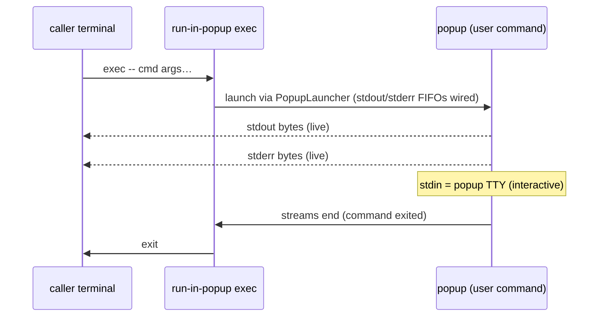

# IDEA — exec becomes a plain stream bridge

Gate: confirmed by user, 2026-08-19 — "Continue" given in direct
response to the gate summary (bridge shape as drafted; exit code =
exchange status only).

## How it should be

`run-in-popup exec` stays, but sheds its machinery. It runs the user's
command inside the popup **directly** — no `exec-payload` wrapper
process, no `ExecResult` JSON report — and simply connects the popup
command's stdout and stderr back to the caller's stdout and stderr.
What the command prints is what the caller gets, live, byte for byte.

The wrapper imposed a contract on the popup command (its stdout was
captured into a result report); that constraint disappears. The
JSON-exchange contract lives purely in the library:
`JsonIpcLauncher[In, Out]`'s documented contract is *the command
executed inside the popup writes JSON values to its stdout* — and a
future refactor may add an exec-shaped helper that converts an
arbitrary command's output/exit status into JSON. This plan does not
design that helper.

## Use cases

- **gpg user** (unchanged): `run-in-popup pinentry` behaves exactly as
  today. Nothing on this path may change.
- **`run-in-popup exec` user**: `run-in-popup exec -- make test` opens
  the popup, `make test` runs there with the popup TTY as its stdin (so
  it can be interactive), while its stdout and stderr stream back to
  the invoking terminal/pipeline. When the exchange ends, `exec`
  returns. `run-in-popup exec -- fzf` -like flows become natural: pick
  in the popup, the selection lands on the caller's stdout.
- **Library consumer wanting structured popup IPC**: uses
  `JsonIpcLauncher[In, Out]` with their own JSON-emitting popup
  command. The exec CLI is no longer its consumer; the generic tests
  and doc contract carry it.

## Usability requirements

- Invocation shape is unchanged: `run-in-popup exec [flags] -- command
  [arg...]`, same backend/config flags.
- Output is a live stream, not a post-hoc report; ordering within each
  stream is preserved. stdin stays on the popup TTY so the command can
  prompt the user there.
- Exit code: idea-level open question — see PLAN.md open questions
  (the wrapper that used to smuggle the inner status out is gone).
- Failure experience: launch/backend failures are reported on stderr
  as today ("popup failed: …"); a popup dismissed mid-command ends the
  streams and `exec` returns rather than hanging.
- README/help describe the bridge honestly; no mention of `ExecResult`
  JSON, the payload argv, or the old exit-code contract survives.
