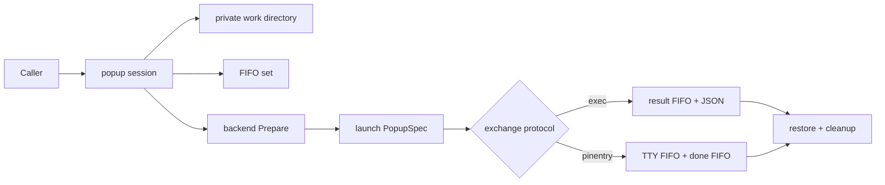
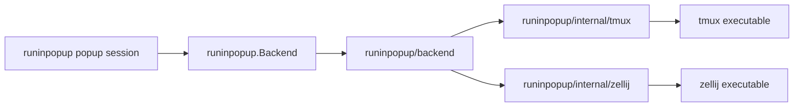

# Refactoring opportunities

This document records refactoring opportunities found in the `main` worktree on
2026-08-17. The aim is to reduce change risk and duplicated policy without
changing the CLI, JSON result, configuration, `PINENTRY_USER_DATA`, or backend
contracts unless an item explicitly says otherwise.

## Agreed direction

The following points are decisions for the next design pass, not open ideas:

1. Extract the common popup-session pattern: create a private work directory,
   create its FIFO endpoints, prepare and launch the backend, perform the
   exchange, and clean up. Backend capabilities may alter construction and
   launcher behavior, but must not duplicate the lifecycle.
2. Split TTY acquisition from Assuan rewriting and pinentry process execution.
3. Use `github.com/ngicks/go-common/iopipe` for cancellable process stdio rather
   than maintaining an ad hoc `os.Pipe` plus an unowned goroutine.
4. Make `runinpopup/backend` own backend names, enumeration, detection, and
   construction. The parent `runinpopup` package owns only the backend contract
   (`Backend`, `PopupSpec`) and popup-session orchestration.
5. Proceed with the P1 CLI runtime/backend-resolution extraction.
6. Move terminal-multiplexer command construction and invocation into
   `runinpopup/internal/tmux` and `runinpopup/internal/zellij`. Public backend
   implementations retain mechanism policy and delegate executable operations
   to those internal clients.
7. Remove `Backend.PopupCommand` and `Backend.Environ`. A backend actively
   launches through its internal multiplexer client and returns a launcher
   handle; raw argv and process environment are no longer part of the public
   backend contract.

## Baseline

- The repository is a Go 1.26 module with one primary Cobra CLI, two deprecated
  compatibility binaries, an importable `runinpopup` package, and three popup
  backends.
- `go test ./...` passes and `go vet ./...` reports no findings in the current
  environment.
- Most backend command construction is well covered. The important gap is the
  pinentry orchestration itself: `callPinentry` has no end-to-end test, while
  the exec FIFO transport has extensive tests.
- A non-cached coverage run caused the untagged tmux live tests to fail because
  the restricted environment denied access to tmux's socket directory. This is
  a test-isolation problem, not an observed product failure.
- The timing-sensitive FIFO flows are heavily documented. File size alone is
  not a reason to fragment them; refactors should preserve their ordering and
  lifecycle invariants explicitly.

## Recommended order

| Priority | Refactor | Value | Risk |
| --- | --- | --- | --- |
| P0 | Characterize pinentry lifecycle and isolate live tests | Creates a trustworthy safety net | Low |
| P1 | Extract a common popup-session lifecycle | Makes the dominant execution pattern explicit | Medium |
| P1 | Make launcher versus payload completion explicit | Removes backend-dependent `Run` semantics | Medium |
| P1 | Split TTY acquisition, Assuan rewriting, and pinentry execution | Separates three different protocols | Medium |
| P1 | Adopt `go-common/iopipe` at the stdio boundary | Gives cancellation and ownership defined semantics | Medium |
| P1 | Extract CLI runtime/backend resolution | Removes duplicated selection policy | Low |
| P1 | Move backend vocabulary into `runinpopup/backend` | Fixes package ownership and removes forwarding APIs | Low |
| P1 | Move multiplexer invocation into internal clients and remove `PopupCommand` | Separates backend policy from executable mechanics | Medium |
| P2 | Split exec by responsibility, preserving protocol | Makes the 505-line subsystem navigable | Low |
| P2 | Establish one configuration schema source | Prevents config/help/docs drift | Medium |
| P3 | Retire or centralize compatibility shims | Removes duplicated legacy startup policy | Low |
| P3 | Remove scaffold residue and tighten resource cleanup | Small maintenance win | Low |

## P0. Characterize pinentry lifecycle and isolate live tests

### Evidence

- `runinpopup/pinentry.go:114` owns FIFO creation, popup launch, TTY discovery,
  Assuan rewriting, pinentry execution, cancellation, and cleanup in one flow.
- Current tests only cover `CallPinentry`'s option/interface rejection paths
  (`runinpopup/run_test.go:109`); the body of `callPinentry` is not exercised.
- `runinpopup/backend/tmux_live_test.go:89` and `:141` start real tmux servers
  as part of the default package tests. They assume the host permits tmux
  socket creation.
- Presentation packages `runinpopup/cli` and both deprecated command packages
  have no direct tests.

### Refactor

1. Add a fake handshaking backend and injectable process/stdio seams sufficient
   to characterize these behaviors without a real multiplexer:
   TTY replacement, unchanged non-TTY Assuan lines, popup dismissal, pinentry
   start failure, cancellation, and FIFO timeout.
2. Move the real-tmux tests behind an explicit integration mechanism, such as
   a `//go:build integration` tag, and document the command that enables them.
   Keep the pure version parsing and argv tests in the default suite.
3. Add small table tests for `cli.RenderConfig` and `cli.RenderExecResult`.

### Done when

- `go test ./...` is hermetic on a machine with tmux installed but unusable.
- An Assuan transcript test proves the exact bytes forwarded to pinentry.
- Cancellation tests prove every owned process and pipe is released.

## P1. Extract a common popup-session lifecycle

### Boundary

The common abstraction is a **popup session**, not a generic command-result
function:

- `exec` runs the user's command in the popup and receives a final JSON result
  through a FIFO.
- `pinentry` runs only a TTY-announcement payload in the popup. The actual
  pinentry process runs outside the popup with its Assuan stream redirected to
  the announced TTY, and a second FIFO dismisses the popup.

Those exchange protocols share lifecycle but not direction, completion, or
error semantics. The lifecycle should therefore supply concrete resources to
an exchange implementation rather than trying to hide both protocols behind a
single generic FIFO API.



### Evidence

- Both `CallExec` and `CallPinentry` call `withPopupPrepared` and `startPopup`,
  create mode-`0600` FIFOs below a caller-provided directory, observe the popup
  launcher asynchronously, and use the FIFO protocol—not launcher exit—as the
  useful completion signal.
- Workspace creation is still duplicated above the library in `runExec`,
  `runPinentry`, and the two compatibility shims.
- Backends have different launcher lifetime behavior: tmux `display-popup`
  generally waits for popup closure, while the floating-pane launchers may
  return after pane creation. A successful launcher exit cannot mean session
  completion.

### Refactor

Add an unexported `popupSession`/`withPopupSession` layer under `runinpopup` that
owns, in order:

1. a mode-`0700` temporary work directory and its retention policy;
2. declared FIFO endpoints, created mode `0600` and cleaned as a set;
3. `Backend.Prepare` and best-effort restore;
4. popup command construction/start and launcher diagnostics;
5. exchange execution using the prepared paths;
6. process, file, restore, and directory cleanup on every exit.

Use narrow callbacks or an internal exchange interface for only the varying
parts: which FIFO endpoints exist, how `PopupSpec` is built, and what event
completes the exchange. Keep the ordering in the session implementation rather
than scattering it among hooks.

Start this as an internal implementation detail behind `CallExec` and
`CallPinentry`. A hook-heavy exported framework would freeze accidental
complexity into the public API. Export a composable session API only after a
third real exchange needs it.

Make `TempDir` optional or replace the duplicated option fields with a common
workspace option: ordinary callers let the library create and remove it;
tests/debug callers may supply or retain one. Retention must report the final
path through a result or structured log so it is discoverable.

### Invariants

- Exchange protocol completion is authoritative; launcher success is not.
- Launcher failure is diagnostic input and may shorten a rendezvous wait, as
  `CallExec` does today, but must not race an already-starting payload.
- Every FIFO lives below the private session directory and is opened with the
  protocol-specific mode. Sharing lifecycle must not make reader and writer
  rendezvous rules generic.
- Cleanup preserves the primary error and reports restore/cleanup errors
  separately or joins them without losing the cause.

### Done when

- `CallExec` and `CallPinentry` contain exchange-specific work only.
- Directory, FIFO, backend preparation, launch, and cleanup have one owner.
- Compatibility shims no longer create their own run directories.
- Tests cover failure at each lifecycle boundary and prove cleanup.

## P1. Make launcher versus payload completion explicit

### Evidence

`runinpopup.Run` is named like a payload-level operation, but its documented
completion is the popup launcher's exit. For tmux `display-popup` that often
coincides with popup closure; for zellij and tmux floating panes it may occur
immediately after pane creation while the payload continues. The same public
function therefore has observably different completion semantics by backend.

### Refactor

Make the low-level operation explicitly a launch operation. Internally, return
a handle that distinguishes launcher observation from exchange completion:

```go
type popupLaunch struct {
    // internal process/diagnostic state
}

func launchPopup(...) (*popupLaunch, error)
func (p *popupLaunch) WaitLauncher() error
```

The popup session observes `WaitLauncher` for errors and diagnostics, while its
exchange protocol determines payload completion. `CallExec` completes on its
result FIFO; `CallPinentry` completes after pinentry and dismissal signaling.

For the exported `Run`, either rename/deprecate it in favor of an accurately
named low-level `Launch` API, or redefine it using a payload-completion
protocol. Do not silently change its wait behavior. The tentative choice is to
deprecate it as a launcher-level primitive and keep high-level, protocol-backed
operations as the stable API.

### Done when

- No internal caller treats successful launcher exit as payload completion.
- Public docs and names distinguish launch, launcher exit, popup dismissal, and
  payload completion.
- Tests cover early successful launcher exit and late launcher failure for all
  exchange types.

## P1. Split TTY acquisition, Assuan rewriting, and pinentry execution

### Evidence

`PinentryHandshaker` and `callPinentry` currently combine three concepts:

1. a backend-specific way to announce a popup TTY securely;
2. an Assuan line transformer that replaces `OPTION ttyname=`;
3. child-process execution and stdio/cancellation ownership.

The backend capability is not inherently about pinentry. It is the capability
to open a popup, report its TTY, and remain alive until dismissed.

### Refactor

- Rename and generalize `PinentryHandshaker`/`PinentryHandshake` to a TTY
  rendezvous capability, such as `TTYHandshaker`/`TTYHandshake`. It owns only
  construction and validation of the TTY/done exchange.
- Move the Assuan behavior into a small, testable transformer, for example
  `rewriteAssuanTTY(io.Reader, io.Writer, tty string) error`. It owns framing,
  replacing only `OPTION ttyname=`, propagating read/write errors, and no
  process lifecycle.
- Keep pinentry execution in a coordinator that connects the TTY result,
  cancellable agent streams, and child process. It must not know how a backend
  encoded or guarded its TTY announcement.

Avoid a general Assuan framework unless more commands are needed. A focused
stream transformer with transcript tests is enough and keeps protocol policy
visible.

### Done when

- Backends no longer import or name a pinentry-specific capability.
- Assuan transcript tests cover replacement, pass-through, malformed/long
  input, EOF, and read/write failures.
- The pinentry coordinator can be tested with a fake TTY handshake and fake
  process independently.

## P1. Adopt `github.com/ngicks/go-common/iopipe`

### Evidence

- `callPinentry` currently builds an `os.Pipe`, starts an `io.Copy` goroutine
  that is intentionally never joined, and closes process-global `os.Stdin` in
  an attempt to unblock it.
- The `go-edit-cobra` cancellable-stdio guidance standardizes on
  `iopipe.NewReader`/`NewWriter`, controller `Run(ctx)`, derived `Pipe(ctx)`
  endpoints, and a one-shot completion channel carrying `*iopipe.CloseError`
  with delivered-byte count and cause.

### Refactor

Create `iopipe` controllers at the OS-stdio boundary and pass the derived
`io.ReadCloser`/`io.WriteCloser` into the pinentry coordinator. Run each
controller under an owned lifecycle group. Closing a derived endpoint pauses
forwarding without closing the underlying process-global file, so the library
must never close `os.Stdin`/`os.Stdout` themselves.

Consume every `Pipe` completion channel exactly once. Define which errors are
primary:

- a child/process or Assuan error remains primary;
- context cancellation is returned when it caused shutdown;
- an `iopipe.CloseError` before the protocol completed is not silently dropped
  and retains its delivered-byte count for diagnostics;
- a clean pipe completion after successful protocol completion is not promoted
  to an error.

Whether controllers are created in the Cobra command or in an OS-facing
adapter under `runinpopup` should follow dependency injection: the core
coordinator accepts interfaces, while only the outermost adapter names
`os.Stdin`, `os.Stdout`, and `os.Stderr`.

### Done when

- No fire-and-forget stdio goroutine remains.
- No library code closes process-global stdio.
- Cancellation deterministically ends the controllers, derived pipes,
  transformer, and child process.
- Tests assert both byte delivery and `CloseError` handling.

## P1. Extract CLI runtime and backend resolution

### Evidence

`runExec` (`cmd/run-in-popup/commands/exec.go:75`) and `runPinentry`
(`cmd/run-in-popup/commands/pinentry.go:84`) duplicate the same sequence:

1. load and overlay configuration;
2. parse `PINENTRY_USER_DATA`;
3. resolve configured versus detected backend;
4. copy environment-derived fields into `backend.Options`;
5. construct the backend;
6. create and close a run workspace.

The copies have already accumulated policy comments independently, notably the
choice of `$SHELL` fallback and backend detection order.

### Refactor

Add a command-layer runtime assembler, for example
`cmd/run-in-popup/commands/runtime.go`, with narrow helpers such as:

```go
type runtimeInputs struct {
    ConfigPath string
    Backend    *string // nil means no flag override
}

type commandRuntime struct {
    Config   runinpopup.Config
    UserData runinpopup.PinentryUserData
    Backend  runinpopup.Backend
}

func resolveRuntime(inputs runtimeInputs, environ []string) (commandRuntime, error)
```

Keep Cobra flag inspection in each command and pass explicit values into the
helper. Do not hide `os.Getenv` calls inside the public `runinpopup` service;
the existing library boundary correctly keeps environment policy in the CLI.
Workspace naming and debug-retention policy may remain command-specific. The
command should pass those policies into the popup session; it should not create
the IPC directory itself.

### Done when

- Backend precedence and `backend.Options` construction exist in one place.
- Pure table tests cover flag/config/user-data/tmux/zellij precedence.
- CLI behavior is unchanged; any library API movement is limited to the
  separately documented backend-vocabulary and `Run` decisions.

## P1. Move backend vocabulary into `runinpopup/backend`

### Evidence

- Canonical backend values and detection currently live in
  `runinpopup/backend.go` as `BackendTmuxPopup`,
  `BackendTmuxFloatingPane`, `BackendZellij`, `BackendNames`, and
  `DetectBackendName`.
- `runinpopup/backend/backend.go` is the factory package, but its constants,
  `Names`, and `DetectName` only forward to the parent package.
- Concrete backends and CLI callers already import `runinpopup/backend`; that
  is the natural owner of vocabulary accepted by `backend.New`.

### Refactor

Move the canonical constants and implementations of `Names` and `DetectName`
to `runinpopup/backend/backend.go`. Keep only mechanism-neutral contracts in
the parent package:

```go
// package runinpopup
type Backend interface { /* popup contract */ }
type PopupSpec struct { /* mechanism-neutral payload */ }

// package backend
const (
    NameTmuxPopup        = "tmux-popup"
    NameTmuxFloatingPane = "tmux-floating-pane"
    NameZellij           = "zellij"
)

func Names() []string
func DetectName(userDataKind, tmuxEnv, zellijEnv string) (string, error)
func New(name string, opts Options) (runinpopup.Backend, error)
```

There is an import-direction consequence: the parent `runinpopup` package
cannot re-export aliases from `runinpopup/backend`, because concrete backends
already import the parent contracts and that would create an import cycle.
Keeping literal duplicate compatibility constants would also defeat the
ownership fix. Therefore removing `runinpopup.Backend*`, `BackendNames`, and
`DetectBackendName` is a deliberate public API break, or requires a separately
agreed compatibility period with duplicated deprecated constants. Given the
module is pre-1.0, the clean break is the tentative default.

Move the detection tests with the implementation. Generate CLI help from
`backend.Names()` so adding a backend updates accepted vocabulary and displayed
values through one owner.

### Done when

- Backend name literals are declared once, in `runinpopup/backend`.
- Detection, enumeration, and factory tests live in that package.
- The parent package contains no backend-name knowledge.
- The API break is called out in release notes if the old exported symbols are
  removed.

## P1. Move multiplexer invocation into internal clients and remove `PopupCommand`

### Boundary

`runinpopup/backend` should describe what each popup mechanism means. The new
internal packages should know how to speak to the corresponding executable:



The scope is **multiplexer invocation**. Execution of the user's payload and
pinentry binary remains in the appropriate exec/pinentry coordinator; those
are not tmux or zellij commands.

### Evidence

- `runinpopup.Backend.PopupCommand` currently returns `(path, args)`, while
  `runinpopup/startPopup` applies environment, cancellation, stdout/stderr, and
  `exec.CommandContext`. This leaks executable mechanics into the shared
  session layer.
- `runinpopup/backend/tmux_floating_pane.go:177` separately invokes tmux for
  version and zoom-state operations, duplicating environment and error-output
  handling outside the popup-launch path.
- The three concrete `PopupCommand` methods own raw tmux/zellij argv details,
  and zellij additionally owns shell wrapping and environment rendering.
- Exact argv assertions dominate `runinpopup/backend/backend_test.go`, coupling
  backend policy tests to CLI syntax details.

### Refactor

Create executable adapters with binary-specific request/result types:

```go
// runinpopup/internal/tmux
type Client struct {
    // binary path and effective TMUX environment
}

func (c *Client) StartPopup(ctx context.Context, req PopupRequest) (Process, error)
func (c *Client) Version(ctx context.Context) (Version, error)
func (c *Client) ZoomedPane(ctx context.Context, target string) (ZoomState, error)
func (c *Client) ToggleZoom(ctx context.Context, paneID string) error

// runinpopup/internal/zellij
type Client struct {
    // binary path, session and shell
}

func (c *Client) StartPopup(ctx context.Context, req PopupRequest) (Process, error)
```

The exact exported names inside these `internal` packages may vary; their
contracts should remain typed and small. A shared internal `Process`/launch
handle should expose only the operations the popup session needs, principally
launcher waiting and cancellation diagnostics.

Remove `PopupCommand` and `Environ` from the parent backend contract. They are
not retained as optional or compatibility methods: doing so would preserve two
competing invocation paths. Replace them with active launch delegation:

```go
type PopupStreams struct {
    Stdout io.Writer
    Stderr io.Writer
}

type PopupLauncher interface {
    Wait() error
}

type Backend interface {
    Name() string
    Launch(
        ctx context.Context,
        spec PopupSpec,
        streams PopupStreams,
    ) (PopupLauncher, error)
    Prepare(ctx context.Context) (restore func(context.Context) error, err error)
}
```

Context cancellation is part of `Launch`: the internal client configures the
underlying process to receive SIGINT when the context ends. Consequently the
popup session needs only `PopupLauncher.Wait`; it does not need access to
`*exec.Cmd`, raw argv, environment mutation, or a separate kill method.

### Public surface delta

```go
/*
Removed from runinpopup.Backend:
    PopupCommand(spec PopupSpec) (path string, args []string)
    Environ() []string
*/

// Added to package runinpopup:
type PopupStreams struct {
    Stdout io.Writer
    Stderr io.Writer
}

type PopupLauncher interface {
    Wait() error
}

// Final runinpopup.Backend surface:
type Backend interface {
    Name() string
    Launch(
        ctx context.Context,
        spec PopupSpec,
        streams PopupStreams,
    ) (PopupLauncher, error)
    Prepare(ctx context.Context) (restore func(context.Context) error, err error)
}
```

Concrete backends translate mechanism-neutral `PopupSpec` into an internal
client request. The internal clients then own:

- exact tmux/zellij argv and flag ordering;
- executable path/defaults and process environment;
- `exec.CommandContext`, SIGINT cancellation, and stdout/stderr attachment;
- binary-specific stderr decoration;
- parsing raw command output such as `tmux -V` and zoom-state fields.

The public backend layer retains:

- backend names, factory selection, and option validation;
- whether a mechanism uses client or session targeting;
- capability decisions such as TTY rendezvous support;
- the tmux floating-pane crash-workaround policy: when to query/de-zoom and
  when to restore. It calls typed `internal/tmux.Client` operations to enact
  that policy.

Do not let the internal clients import `runinpopup.PopupSpec`; use their own
binary-oriented request types. This keeps the direction clear: public backend
code translates service semantics into executable mechanics, and the clients
cannot grow service policy accidentally.

### Relationship to shell rendering

Move shell-line rendering alongside these adapters. If both executables need
identical POSIX word quoting, share only that primitive through
`runinpopup/internal/shellargv`; tmux and zellij retain their different rules
for when a shell is required. This folds the separate shell-rendering cleanup
into the invocation migration.

### Testing

- Move exact argv, environment, raw-output parsing, and executable-error tests
  to `runinpopup/internal/tmux` and `runinpopup/internal/zellij`.
- Keep backend tests focused on `PopupSpec` translation, capability selection,
  targeting policy, and preparation/restoration decisions.
- Keep integration tests against private tmux/zellij instances separate from
  unit tests. Internal clients need a controllable command/process seam or
  helper-process tests so error and cancellation paths are deterministic.

### Done when

- `runinpopup/run.go` contains no tmux/zellij `exec.CommandContext` setup and
  no multiplexer environment manipulation.
- `Backend`, its implementations, and its tests contain no `PopupCommand` or
  `Environ` method.
- `runinpopup/backend` contains no raw command execution or stderr parsing.
- Each multiplexer executable has one invocation path for popup launch and
  auxiliary commands.
- Backend policy tests do not assert entire raw argv arrays unless the argv is
  itself the policy under test.
- The `Backend` interface break and migration are recorded with the other
  pre-1.0 API changes.

## P2. Split exec by responsibility without redesigning its transport

### Evidence

`runinpopup/exec.go` is 505 lines and contains four distinct concerns:

- exported result/options and wire vocabulary (`:23-113`);
- caller-side popup/FIFO rendezvous (`:155-358`);
- payload-side rendezvous and command execution (`:369-460`);
- process-status conversion and result serialization (`:463-505`).

These areas change for different reasons. The existing tests show the protocol
is already cohesive and well characterized, so a behavioral redesign is not
needed.

### Refactor

Move code, without changing symbols or ordering, into:

- `exec_types.go` — public protocol and options;
- `exec_caller.go` — `CallExec`, popup launch, reader rendezvous;
- `exec_payload.go` — `ExecPayload`, command execution, writer rendezvous;
- `exec_status.go` — exit-status translation and encoding.

Keep caller and payload FIFO helpers separate. Although both open FIFOs, their
blocking modes, failure meanings, and cancellation semantics differ; a generic
FIFO abstraction would obscure the protocol.

### Done when

- The exported API and JSON are byte-for-byte unchanged.
- Existing exec tests move beside their responsibility and still pass.
- A short package comment points readers from the caller half to the payload
  half and documents the rendezvous invariant once.

## P2. Establish one source for configuration schema metadata

### Evidence

- `Config` and `PartialConfig` duplicate every field and serialization tag in
  `runinpopup/config.go:44` and `:104`.
- `PartialConfig.Apply` manually repeats the same field list at `:122`.
- `configLongFmt` in `cmd/run-in-popup/commands/config.go:13` manually lists the
  schema again and currently describes only `tmux-popup` and `zellij`, despite
  `tmux-floating-pane` being a supported value.
- README configuration tables are another manually maintained copy.

### Refactor

Keep the concrete and sparse types—they express useful, different contracts—
but add one authoritative schema-description function or generated artifact
used by command help and documentation checks. Add reflection-based tests that
assert `Config` and `PartialConfig` have matching JSON field trees and that
every backend name appears in generated help. Avoid putting reflection in the
runtime merge path.

If schema growth makes `Apply` repetitive, generate the sparse structs and
merge methods with `go generate`; do not replace typed configuration with
`map[string]any`.

### Done when

- Adding a config field causes one clear test/generation failure at every
  contract that must be updated.
- Supported backend names in Cobra help come from `backend.Names()` or an
  equivalent single source.
- JSON/config public surfaces remain unchanged.

## P3. Retire or centralize compatibility shims

### Evidence

`cmd/tmux-popup-pinentry-curses/main.go` and
`cmd/zellij-popup-pinentry-curses/main.go` independently implement signals,
deprecation output, user-data validation, backend construction, workspace
creation, logging, and `CallPinentry`. Their backend-specific differences are
small, but compatibility comments indicate that some odd behavior is
intentional.

### Refactor

First decide and document a removal release for the deprecated binaries. If
they will survive more than one release, extract an `internal/legacyshim`
runner parameterized by backend kind, validation text, workspace prefix, and
debug compatibility. Keep each `main.go` as a tiny adapter. If removal is near,
do not spend effort abstracting them; add smoke tests and delete them at the
announced boundary instead.

This item intentionally requires a product decision because deleting installed
entrypoints is a public-surface change.

## P3. Remove scaffold residue and tighten cleanup

### Evidence

- `cmd/run-in-popup/commands/root.go:60-69` retains generic scaffold TODOs that
  no longer describe active work.
- `runworkspace.Open` creates a directory at
  `internal/runworkspace/runworkspace.go:45`, but if opening the debug log fails
  at `:57`, it returns without removing that directory.
- `Workspace.Close` discards every cleanup error (`:71-77`), which is reasonable
  for most callers but makes cleanup failures impossible to test or report.

### Refactor

Remove the obsolete TODOs. Absorb IPC-directory ownership into the new popup
session; leave `runworkspace` only as debug-log policy if it is still useful,
or remove it entirely. During migration, roll back a newly created workspace
when log creation fails. The session cleanup path should return or log cleanup
errors without replacing the primary exchange failure.

## Ideas deliberately not recommended now

- **A generic FIFO package:** exec-result and pinentry-handshake FIFOs have
  materially different open modes and lifecycle contracts. Sharing them would
  hide rather than remove complexity.
- **A dynamic backend registry:** three compile-time backends do not justify
  registration globals or init-time mutation. Consolidating names/help is
  sufficient until third-party backends are a real requirement.
- **Breaking up `callPinentry` merely because it is long:** its FIFO order is a
  protocol invariant. Extract only pure transformation and ownership seams,
  backed by characterization tests.
- **Replacing typed config with maps/reflection:** it would trade a little
  repetition for weaker public contracts and later failures.

## Suggested execution slices

1. Hermetic test split plus pinentry transcript characterization.
2. Add `runinpopup/internal/tmux` and `runinpopup/internal/zellij`; move raw
   invocation tests and backend vocabulary, then replace `PopupCommand` and
   `Environ` with active `Launch` delegation in the backend contract.
3. Extract the CLI runtime/backend resolver against the new backend factory.
4. Introduce the popup session and explicit launcher handle; migrate exec first
   because its result FIFO already has strong characterization tests.
5. Add the TTY rendezvous abstraction, Assuan transformer, and `iopipe`; migrate
   pinentry onto the session.
6. Migrate compatibility shims and remove redundant workspace ownership.
7. Mechanically split exec files after the lifecycle settles.
8. Add config schema metadata/help generation and finish small cleanup.

Run `go test ./...` and `go vet ./...` after every slice. Run the tagged tmux
integration suite separately on a host that permits private tmux sockets.
